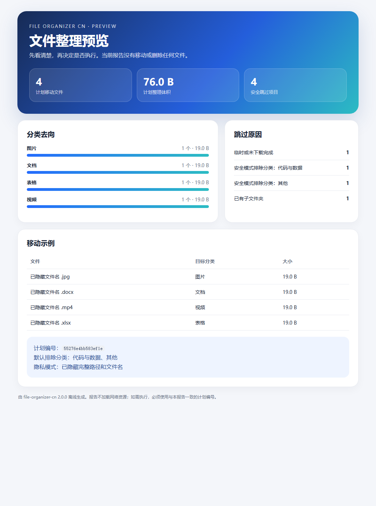

# file-organizer-cn

我做的一个中文文件整理 Skill：先预览并锁定方案，再确认执行，整理后还能撤销。

它基于 [crazynomad/skills](https://github.com/crazynomad/skills) 中 `file-organizer` 的思路改良，保留原项目 MIT 许可与署名，并重点补齐：

- Windows、macOS、Linux 跨平台；
- 默认只扫描目标文件夹第一层，不打散已有子文件夹；
- 预览阶段零写入；
- 预览生成唯一计划编号，文件变化后旧编号自动失效；
- 正式整理必须显式确认并携带相同计划编号；
- 同名文件自动编号，绝不覆盖；
- 每次整理保留 JSON 清单，可以撤销；
- 默认跳过代码与无法识别类型的文件；
- 可以生成默认隐藏文件名和路径的离线 HTML 报告；
- 不删除任何文件；
- 面向中文普通用户的首次使用引导和失败处理。

## 一句话安装

```bash
npx skills add haya-hello/file-organizer-cn --skill file-organizer-cn -g -y
```

安装后对支持 Agent Skills 的工具说：

```text
使用 file-organizer-cn，先预览我的下载文件夹怎么整理，不要移动文件。
```

看过方案后再说：

```text
按刚才的方案执行整理。
```

需要反悔时说：

```text
使用 file-organizer-cn，撤销下载文件夹最近一次整理。
```

## 直接运行

只需要 Python 3.9 或更高版本，不需要安装任何 Python 包。

```powershell
# 只预览，不改变文件 / Preview only, no file changes
python ".\file-organizer-cn\scripts\file_organizer.py" preview "downloads"

# 看过预览后正式整理 / Organize after reviewing the preview
python ".\file-organizer-cn\scripts\file_organizer.py" organize "downloads" --confirm --plan-id "<预览编号>"

# 生成隐私友好的可视化报告 / Generate a privacy-friendly visual report
python ".\file-organizer-cn\scripts\file_organizer.py" report "downloads" --output ".\整理预览.html"

# 查看历史 / List organization history
python ".\file-organizer-cn\scripts\file_organizer.py" history "downloads"

# 撤销最近一次 / Undo the latest run
python ".\file-organizer-cn\scripts\file_organizer.py" undo "downloads" --confirm

# 只读查找大文件 / Find large files without modifying them
python ".\file-organizer-cn\scripts\file_organizer.py" large "downloads" --min-size 100
```

`downloads` 也可以换成 `desktop`、`documents`、`pictures`、中文别名或绝对路径。

## 整理结果

文件默认移动到目标文件夹内：

```text
目标文件夹/
├─ 已整理/
│  ├─ 文档/
│  ├─ 表格/
│  ├─ 图片/
│  ├─ 视频/
│  └─ 其他/
└─ .file-organizer-cn/
   └─ history/
      └─ 一次整理对应一个 JSON 撤销记录
```

工具不会进入原有子文件夹，也不会自动删除、去重或覆盖文件。

默认安全模式还会跳过“代码与数据”和“其他”分类。确实需要整理这些文件时，在预览和执行命令中同时添加 `--include-risky`。要跳过某一分类，可以使用 `--exclude-category "图片"`。

## 为什么要有计划编号

普通的“先预览、再执行”仍然有一个漏洞：预览后下载文件夹可能继续变化，正式执行时实际移动的内容已经不是用户刚才看到的方案。

因此，预览会根据目标文件夹、整理选项、待移动文件的路径、大小、修改时间和目标位置生成一个 `plan_id`。正式执行必须带上这个编号；只要待移动文件、目标位置或整理选项发生变化，旧编号就会失效，工具会要求重新预览。

## 可视化预览报告

`report` 命令会生成一个完全离线的 HTML 页面，展示：

- 准备移动的文件数量和体积；
- 每个分类的数量和比例；
- 跳过项目及原因；
- 当前计划编号；
- 最多 12 条移动示例。

默认报告隐藏完整路径和文件名，只保留扩展名、分类和大小，适合分享截图。确实需要本地核对文件名时，可以添加 `--reveal-names`。报告必须保存在待整理文件夹之外，也不会覆盖已有文件。

模拟数据生成的公开示例见 [examples/file-organizer-preview.html](examples/file-organizer-preview.html)，不包含任何真实用户文件。



## 为什么改良这个项目

上游版本为 macOS 下载目录设计，支持智能文件夹和自动归类。这个版本保留“先看方案再整理”的实用核心，把它改造成跨平台、计划锁定、可视化、可恢复、默认更保守的中文 Skill，让第一次接触 Agent 的用户也敢在自己的真实文件夹里使用。

上游快照：`crazynomad/skills@2bc470fc08b47b63af8c1721058672ad0678ab78`

## 开发验证

```bash
python -m unittest discover -s tests -v
python tests/validate_skill.py
```

## 许可与署名

本项目使用 MIT License。原始思路与部分分类设计来自 `crazynomad/skills` 的 `file-organizer`，原作者为 Burn Wang，详见 [LICENSE](LICENSE) 与 [THIRD_PARTY_NOTICES.md](THIRD_PARTY_NOTICES.md)。
